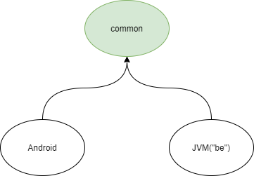

# DailyDish

## Installation

1. Add maven plugin:
```groovy
plugins {
    id 'maven'
}
```
2. Add GitHub packages repository:
```groovy
repositories {
    maven {
        url = "https://maven.pkg.github.com/elderanakain/daily-dish-common"
        credentials {
            username = System.getenv("GITHUB_PUBLISH_USERNAME")
            password = System.getenv("GITHUB_PUBLISH_TOKEN")
        }
    }
}
```
3. Add platform specific dependency:
```groovy
implementation("io.krugosvet.dailydish:common:version")

implementation("io.krugosvet.dailydish:common-jvm:version")

implementation("io.krugosvet.dailydish:common-android:version")
```

## Structure

Overview of spaces:



## Limitations

- Some libraries require to be redefined in common module consumers (e.g. datetime library); [ticket](https://youtrack.jetbrains.com/issue/KT-24309)
- There is no convenient way to have jvm along with android targets; [ticket](https://youtrack.jetbrains.com/issue/KT-28194)
- Naming clashes for android instrumentation tests directory; [ticket](https://youtrack.jetbrains.com/issue/KT-34650)

  It is better to provide source directories explicitly.
```groovy
listOf(
        "androidAndroidTest", "androidAndroidTestDebug", "androidAndroidTestRelease", "androidDebug", "androidRelease",
        "androidTest", "androidTestDebug", "androidTestRelease"
).forEach {
  sourceSets[it].apply {
    dependsOn(sourceSets["androidMain"])
    kotlin.setSrcDirs(listOf("src/$it/kotlin"))
    resources.setSrcDirs(listOf("src/$it/resources"))
  }
}
```
- Time to time `kotlin std-lib` becomes unavailable and break syntax highlighting in IDEA. Only build&gradle clear helps.
